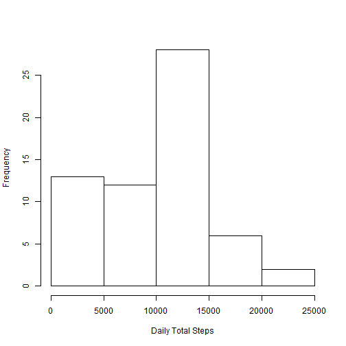
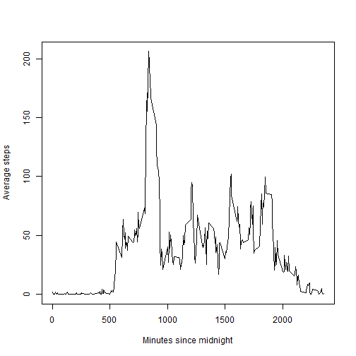
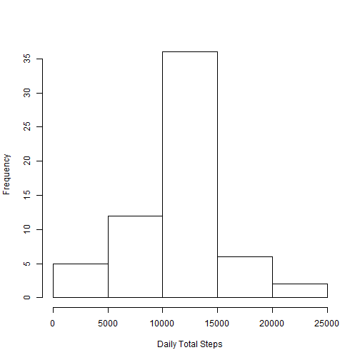
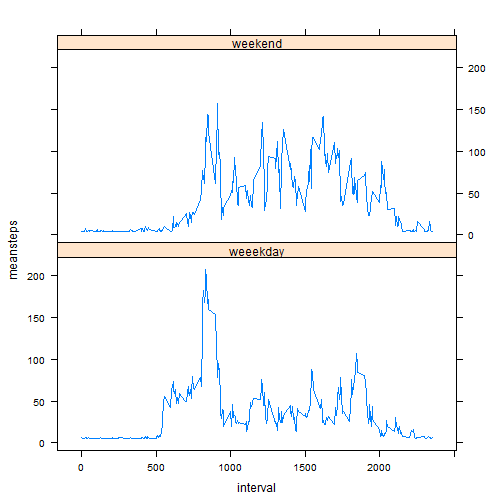

Reproducible Research - Peer Assignment 1
=========================================
Load CSV File

```r
activity <- read.csv("activity.csv")
```

Format date field as Date

```r
activity$date <- as.Date(activity$date, "%Y-%m-%d")
```

Aggregate total steps by date

```r
dailyactivity <- aggregate(activity$steps, by = list(activity$date), FUN = sum, 
    na.rm = T)
names(dailyactivity) <- c("date", "totalsteps")
```

Make a histogram of the total number of steps taken each day

```r
hist(dailyactivity$totalsteps, xlab = "Daily Total Steps", main = "")
```

 

Calculate and report the mean and median total number of steps taken per day  
*Calculate mean daily steps

```r
mean(dailyactivity$totalsteps)
```

```
## [1] 9354
```

*Calculate median daily steps

```r
median(dailyactivity$totals)
```

```
## [1] 10395
```

Make a time series plot of the 5-minute interval (x-axis) and the average number of steps taken, averaged across all days   
*Aggregate activity data by interval

```r
intervalactivity <- aggregate(activity$steps, by = list(activity$interval), 
    FUN = mean, na.rm = T)
names(intervalactivity) <- c("interval", "meansteps")
```

*Plot Average Steps by Interval

```r
plot(intervalactivity$interval, intervalactivity$meansteps, type = "l", xlab = "Minutes since midnight", 
    ylab = "Average steps")
```

 

Which 5-minute interval, on average across all the days in the data set, contains the maximum number of steps?

```r
print(intervalactivity[which.max(intervalactivity$meansteps), "interval"])
```

```
## [1] 835
```

Calculate and report the total number of missing values in the data set

```r
sum(is.na(activity))
```

```
## [1] 2304
```

Calculate mean interval steps to fill in missing data

```r
meanintervalsteps <- round(mean(activity$steps, na.rm = T))
print(meanintervalsteps)
```

```
## [1] 37
```

Create a new data set that is equal to the original data set but with the missing data filled in  
use mean interval steps to fill in missing data into a new imputed activity data set

```r
imputedactivity <- activity
imputedactivity["steps"][is.na(activity["steps"])] <- meanintervalsteps
```

Aggregate imputed activity data by date to create imputed daily activity data set

```r
imputeddailyactivity <- aggregate(imputedactivity$steps, by = list(imputedactivity$date), 
    FUN = sum)
names(imputeddailyactivity) <- c("date", "totalsteps")
```

Make a histogram of the total number of steps taken each day and Calculate and report the mean and median total number of steps taken per day.  
*Create a histogram of Daily Total Steps using imputed daily activity data set

```r
hist(imputeddailyactivity$totalsteps, xlab = "Daily Total Steps", main = "")
```

 

*Calculate mean daily steps using imputed daily activity data set

```r
mean(imputeddailyactivity$totalsteps)
```

```
## [1] 10752
```

*Calculate median daily steps using imputed daily activity data set

```r
median(imputeddailyactivity$totalsteps)
```

```
## [1] 10656
```

Q. Do these values differ from the estimates from the first part of the assignment? What is the impact of imputing missing data on the estimates of the total daily number of steps?    
A. Yes,these values differ from the first part of the assignment. Imputing missing data has an effect of increasing both mean and median daily steps.  


Create a new factor variable in the data set with two levels - "weekday" and "weekend" indicating whether a given date is a weekday or weekend day.  

```r
imputedactivity$day <- "weeekday"
imputedactivity$day[weekdays(imputedactivity$date) == "Sunday"] <- "weekend"
imputedactivity$day[weekdays(imputedactivity$date) == "Saturday"] <- "weekend"
imputedactivity$day <- as.factor(imputedactivity$day)
```

Make a panel plot containing a time series plot of the 5-minute interval (x-axis) and the average number of steps taken, averaged across all weekday days or weekend days (y-axis)  
*Aggregate imputed activity data set by weekday/weekend and interval to create interval imputed activity data set

```r
intervalimputedactivity <- aggregate(imputedactivity$steps, by = list(imputedactivity$day, 
    imputedactivity$interval), FUN = mean)
names(intervalimputedactivity) <- c("day", "interval", "meansteps")
```

*Create a time series plot of the 5-minute interval (x-axis) and the average number of steps taken

```r
library(lattice)
xyplot(meansteps ~ interval | day, data = intervalimputedactivity, layout = c(1, 
    2), type = "l")
```

 

